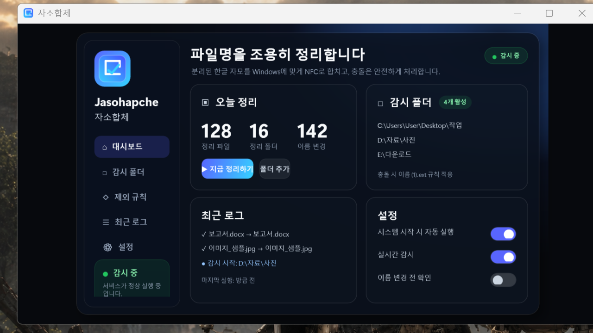

# 자소합체 Windows App

<p align="center">
  
</p>

<p align="center">
  <strong>분리된 한글 자모 파일명을 Windows에서 조용히 합쳐 주는 v0.1.0 배포 패키지.</strong><br>
  macOS에서 복사한 파일, 압축 해제 파일, 클라우드 동기화 폴더의 깨진 한글 이름을 NFC로 정리합니다.
</p>

<p align="center">
  <a href="Jasohapche-Windows-v0.1.0.zip"></a>
  <a href="https://dotnet.microsoft.com/download/dotnet/8.0"></a>
  <a href="https://www.microsoft.com/windows/windows-11"></a>
</p>

---

## 이 저장소는 무엇인가요?

이 저장소는 **자소합체 Windows v0.1.0 실행 배포본**을 바로 내려받기 위한 저장소입니다. 사용자가 압축을 풀고 바로 실행할 수 있도록 필요한 실행 파일과 런타임 자산만 담았습니다.

```text
ㅎㅏㄴㄱㅡㄹ.txt  >  한글.txt
```

## 화면 미리보기 (Screenshots)

<p align="center">
  
</p>

> 위 이미지는 v0.1.0 앱의 WPF 대시보드 미리보기입니다. 이 배포 저장소에는 실행 파일과 런타임 자산만 포함됩니다.

## 바로 다운로드

| 항목 | 값 |
| --- | --- |
| 현재 버전 | `v0.1.0` |
| 다운로드 파일 | [`Jasohapche-Windows-v0.1.0.zip`](Jasohapche-Windows-v0.1.0.zip) |
| 실행 파일 | `v0.1.0\Jasohapche.Windows\Jasohapche.Windows.exe` |
| 대상 런타임 | `.NET 8 / win-x64` |
| 필요 환경 | Windows 10/11 + .NET 8 Desktop Runtime |
| 패키지 안내 | [`v0.1.0/README.md`](v0.1.0/README.md) |

## 빠른 실행

1. [`Jasohapche-Windows-v0.1.0.zip`](Jasohapche-Windows-v0.1.0.zip)을 다운로드합니다.
2. 원하는 폴더에 압축을 풉니다.
3. 실행 파일을 엽니다.

   ```text
   v0.1.0\Jasohapche.Windows\Jasohapche.Windows.exe
   ```

4. 필요한 감시 폴더를 추가합니다.
5. 바로 정리하려면 `지금 검사`를 누릅니다.
6. 창을 닫아도 앱은 시스템 트레이에서 계속 동작합니다.
7. 완전히 종료하려면 트레이 아이콘을 우클릭한 뒤 `종료`를 선택합니다.

## 요구 사항

- Windows 10/11
- [.NET 8 Desktop Runtime](https://dotnet.microsoft.com/download/dotnet/8.0)

실행되지 않거나 Windows가 런타임 설치를 요구하면 .NET 8 Desktop Runtime을 설치한 뒤 다시 실행해 주세요.

## 무엇을 해 주나요?

### 1. 깨진 한글 파일명을 NFC로 정리

- 파일명과 폴더명을 Windows 친화적인 Unicode NFC 형태로 정규화합니다.
- 같은 이름이 이미 있으면 기존 파일을 덮어쓰지 않고 suffix를 붙입니다.

```text
파일.txt가 이미 있을 때: 파일.txt → 파일 (1).txt
```

### 2. 감시 폴더와 수동 검사

- 바탕 화면 / 다운로드 폴더를 기본 감시 대상으로 사용합니다.
- 감시 폴더 추가, 삭제, 열기를 지원합니다.
- `지금 검사`로 등록된 폴더를 한 번에 확인할 수 있습니다.
- 창을 닫아도 트레이에서 계속 상주합니다.

### 3. 제외 규칙

| 유형 | 예시 / 용도 |
| --- | --- |
| 확장자 제외 | `zip`, `tmp` 같은 파일 확장자 제외 |
| 파일명 제외 | 특정 파일명 패턴 제외 |
| 폴더명 제외 | `node_modules`, `.git` 같은 폴더 제외 |
| 경로 포함 제외 | 특정 경로 문자열이 포함된 항목 제외 |
| 숨김 항목 제외 | 숨김 속성 파일/폴더 제외 |

### 4. 데스크톱 사용성

- 시스템 트레이 메뉴: 창 열기, 지금 검사, 감시 시작/일시 중지, 창 숨기기, 종료
- 최근 로그와 오늘 통계 표시
- Windows 시작 시 자동 실행 옵션
- `Dark` / `Carbon Light` 테마
- 활성/일시정지 상태별 트레이 아이콘 포함

## 포함 파일

```text
jasohapche-windows-app/
├── Jasohapche-Windows-v0.1.0.zip
├── README.md
├── docs/assets/readme/
│   ├── app-icon.png
│   └── dashboard.png
└── v0.1.0/
    ├── README.md
    └── Jasohapche.Windows/
        ├── Jasohapche.Windows.exe
        ├── Jasohapche.Windows.dll
        ├── Jasohapche.Core.dll
        ├── Jasohapche.Windows.deps.json
        ├── Jasohapche.Windows.runtimeconfig.json
        └── Assets/
            ├── TrayIcon-A-active.ico
            ├── TrayIcon-A-paused.ico
            ├── TrayIcon-B-active.ico
            ├── TrayIcon-B-paused.ico
            └── ...
```

## 무결성 확인

다운로드한 zip이 이 저장소의 배포본과 같은지 확인하려면 SHA-256 값을 비교하세요.

```text
Jasohapche-Windows-v0.1.0.zip
SHA-256: 1de9624105a95ff3d4ef4e4555a9daf5c5499695d2ccc5a04ebd924cf61736bc
```

PowerShell 예시:

```powershell
Get-FileHash .\Jasohapche-Windows-v0.1.0.zip -Algorithm SHA256
```

## 안전 안내

이 앱은 파일명과 폴더명을 실제로 변경합니다. 중요한 폴더에 사용하기 전에는 작은 테스트 폴더에서 먼저 동작을 확인해 주세요.

- 같은 이름이 이미 있으면 기존 파일을 덮어쓰지 않습니다.
- 접근할 수 없는 항목은 건너뛰고 로그에 남깁니다.
- 민감한 파일명이나 개인 경로가 포함된 로그는 공개적으로 공유하지 마세요.
- Windows 파일 시스템 동작은 Windows 환경에서 최종 확인하는 것을 권장합니다.

## 배포 메모

- 이 저장소는 사용자 다운로드용 실행 배포본입니다.
- `v0.1.0/` 폴더 전체를 함께 보관해야 실행 파일과 아이콘 자산이 정상적으로 동작합니다.
- 이 README는 현재 GitHub에 올라온 v0.1.0 패키지의 실제 파일명과 경로를 기준으로 안내합니다.

## 라이선스

현재 이 배포 저장소에는 별도 `LICENSE` 파일이 없습니다. 공개 재배포 전 라이선스 파일을 추가해야 합니다.
